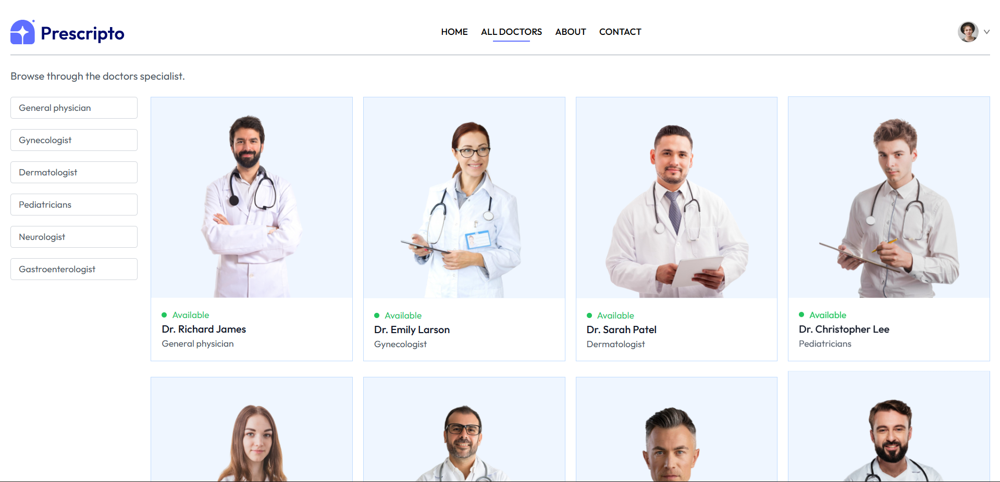
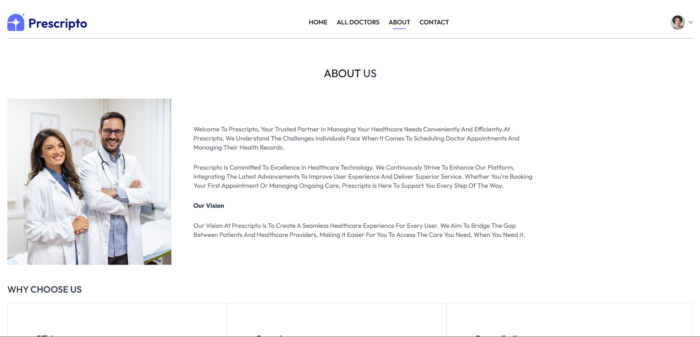

# Doctor Appointment Booking System (MERN)

A full-stack Doctor Appointment Booking System built using the MERN stack (MongoDB, Express, React, Node.js).  
This project allows patients to register, browse doctors, and book appointments, while doctors and admins can manage schedules and data.

---

## Features

- User authentication (JWT-based)
- Role-based access: Admin, Doctor, Patient
- Appointment booking and management
- Doctor profile management
- Admin dashboard for user and doctor management
- Responsive frontend (React + Tailwind CSS)
- RESTful API using Express.js
- MongoDB database integration

---

## Tech Stack

Frontend: React, Tailwind CSS  
Backend: Node.js, Express.js  
Database: MongoDB (Mongoose ODM)  
Authentication: JWT (JSON Web Tokens)  
Optional: Stripe (payments), Cloudinary (image upload)

---

## Folder Structure
```
project-root/
│
├── frontend/                  → React frontend for users/patients
│   ├── src/
│   │   ├── components/
│   │   ├── pages/
│   │   ├── services/
│   │   ├── context/
│   │   └── App.js
│   └── package.json
│
├── admin/                     → React admin dashboard
│   ├── src/
│   │   ├── components/
│   │   ├── pages/
│   │   ├── services/
│   │   └── App.js
│   └── package.json
│
├── backend/                   → Node.js + Express backend API
│   ├── config/
│   ├── controllers/
│   ├── models/
│   ├── routes/
│   ├── middlewares/
│   ├── utils/
│   └── server.js
│
├── .env.example
├── README.md
└── package.json
```
---

## Installation

1. Clone the repository  
   git clone <repo-url>  
   cd <project-folder>

2. Install dependencies  
   - Backend:  
     cd server  
     npm install  

   - Frontend:  
     cd ../client  
     npm install  

3. Set up environment variables  
   - Create a .env file in the /server directory based on .env.example.

4. Run the app  
   - Backend:  
     cd server  
     npm run dev  

   - Frontend:  
     cd ../client  
     npm start  

---

## Environment Variables

Create a .env file in the server directory with the following:

PORT=5000  
MONGO_URI=your_mongodb_connection_string  
JWT_SECRET=your_secret_key  
CLIENT_URL=http://localhost:3000  
STRIPE_SECRET_KEY=your_stripe_key (optional)

---

## Available Scripts

Backend (in /server):  
npm start       → Start production server  
npm run dev     → Start dev server with nodemon  

Frontend (in /client):  
npm start       → Start React app  
npm run build   → Build for production  

---

## Deployment

1. Frontend – build using:  
   npm run build  
   Deploy the client/build folder to Netlify, Vercel, or another hosting service.

2. Backend – deploy on Render, Railway, or VPS.  
   Set environment variables properly on the hosting platform.

---

## 📸 Screenshots

### 🏠 Home Page


---

### 👨‍⚕️ All Doctors Page


---

### ℹ️ About Page


---

### 📞 Contact Page


---

## License

This project is licensed under the MIT License.

---

## 👤 Author
Medipudi Hari Veera
